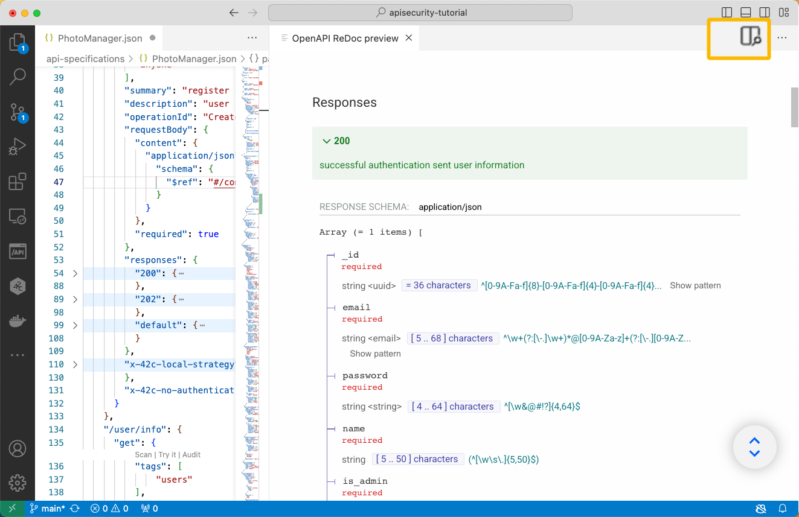
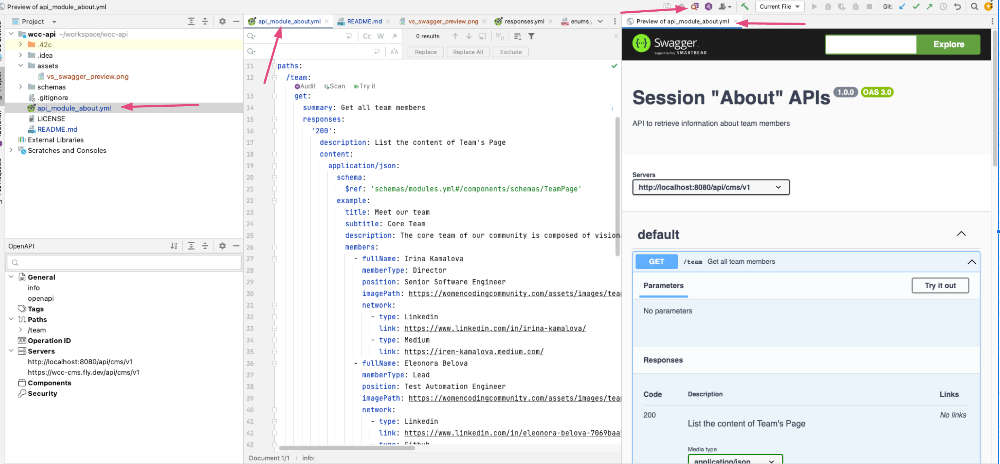

# Women Coding Community - API

Platform Api to communicate with frontend and backend services.

<!-- TOC -->
* [Women Coding Community - API](#women-coding-community---api)
  * [How to Set up Locally](#how-to-set-up-locally)
    * [VSCode](#vscode)
    * [IntelliJ](#intellij)
    * [42Crunch](#42crunch)
  * [How to use](#how-to-use)
    * [View/Edit](#viewedit)
    * [Check for errors](#check-for-errors)
<!-- TOC -->

## How to Set up Locally

Use your editor and install the relevant plugging/extension to edit and to see the APIs.

### VSCode

- Install extension [OpenAPI (Swagger) Editor](https://marketplace.visualstudio.com/items?itemName=42Crunch.vscode-openapi)

- About Swagger Extension


- How to Preview


### IntelliJ 

- [How to install - Open Api (Swagger) Editor](https://plugins.jetbrains.com/plugin/14837-openapi-swagger-editor)

- About Swagger Plugin


- How to Preview


### 42Crunch

Helpful to check if your API is corrected created and no error exist.

* Create an account in [42Crunch](https://platform.42crunch.com/)
* Generate Editor Token
  1. Go to User Setting after logging 
  2. Go to Token > Create new token
  3. Copy the token and go to you Editor
  4. Open one of the API files, for example: [api_module_about.yml](api_module_about.yml)
  5. Go to Path, for example ``/team:``
  6. Click "Audit" Link above the path you want to test
  7. Provide IDE Token and proceed further
  8. The Audit Problem view page will show all the problem exist or no error will show in case of everything correct.

## How to use

### View/Edit

1. Open one of the API files you want to see, for example: [api_module_about.yml](api_module_about.yml)
2. Open the OpenAPI View from your IDE
3. You will be able to see all paths and can start to edit
4. For more details check the plugging webpage

### Check for errors

Follow the steps in listed in [42Crunch setup](#42crunch)


## Execute locally with CURL

* Install [jq](https://jqlang.github.io/jq/) on mac:  
```shell
$ brew install jq
$ curl https://wcc-cms.fly.dev/api/cms/v1/team  | jq .
```

The output should be like this: 
```json
{
  "data": {
    "title": "Meet our team",
    "subtitle": "Core Team",
    "description": "The core team of our community is composed of visionary directors and dynamic leaders, who bring a wealth of experience and dedication to empowering women in technology.",
    "membersByType": {
      "Director": [
        {
          "fullName": "Irina Kamalova",
          "position": "Senior Software Engineer",
          "memberType": "Director",
          "imagePath": "https://womencodingcommunity.com/assets/images/team/8.jpeg",
          "network": [
            {
              "type": "Linkedin",
              "link": "https://www.linkedin.com/in/irina-kamalova/"
            },
            {
              "type": "Medium",
              "link": "https://iren-kamalova.medium.com/"
            }
          ]
        }
      ],
      "Lead": [
        {
          "fullName": "Eleonora Belova",
          "position": "Test Automation Engineer",
          "memberType": "Lead",
          "imagePath": "https://womencodingcommunity.com/assets/images/team/7.jpeg",
          "network": [
            {
              "type": "Linkedin",
              "link": "https://www.linkedin.com/in/eleonora-belova-7069baa5/"
            },
            {
              "type": "Github",
              "link": "https://github.com/nora-weisser"
            }
          ]
        }
      ],
      "Evangelist": []
    }
  },
  "metadata": {
    "pagination": {
      "totalItems": 50,
      "totalPages": 2,
      "currentPage": 1,
      "pageSize": 25
    }
  }
}
```